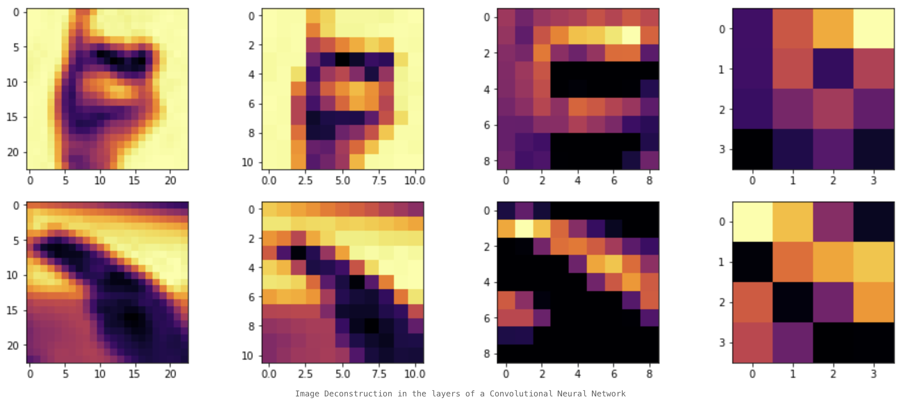

# Data Mining & Machine Learning portfolio

This repository houses the porfolio for Data Mining & Machine Learning (F21DL) course and demonstrates an understanding of the following: 

1. Methods for data preparation and analysis, including probabilistic/Bayesian methods of data
analysis, calculating correlation of features and performing feature selection.
2. Unsupervised Learning and Clustering.
3. Supervised Learning and the problems of generalization and overfitting; Supervised learning
methods including Naïve Bayes, Linear Regression, K-nearest neighbors and Decision trees.
4. Neural Networks and Convolutional Neural networks.

## About 

### The Project

The project aims to solve a classification problem by applying different machine learning techniques and identifying the advantages and limitations of each for the given dataset.

### The Data 

The dataset used in this coursework is an image dataset of American Sign Language (ASL) hand gestures. Creating an ML model for correctly classifying ASL gestures is the first step towards inclusion and improved accessability of services (human-to-human interactions) for people with speech and hearing impairments. ASL datasets are a staple in ML similar to MINST, meaning large datasets with preprocessed images are freely available, yet are bit more complex than MINST thus offering a good gateway into data mining and machine learning with an image dataset that is still challenging.

To challenge myself a bit further, I've combined 3 separate datasets with the intention of creating a larger, more varied dataset and thus a more robust model. In addition, images in the dataset feature each letter in different orientations and backgrounds, lighting conditions and zoom levels further diversifying the dataset, with 4000 images per letter (originally). Considering the computational strain of processing a dataset of 26 letters, I've reduced the number of classes to the first 10 letters of the alphabet (i.e., A - J) and further reduced the number of instances used to 270 per class.

## Acknowledgements 
The dataset is a combination of three Kagle datasets: [Dataset 1](https://www.kaggle.com/grassknoted/asl-alphabet), [Dataset 2](https://www.kaggle.com/ayuraj/asl-dataset), [Dataset 3](https://www.kaggle.com/kapillondhe/american-sign-language). 

Additional material that informed the code and technology implementation:
- Resource on [Image Import](https://www.freecodecamp.org/news/demystifying-gradient-descent-and-backpropagation-via-logistic-regression-based-image-classification-9b5526c2ed46/)
- [Image processing for computer vision](https://www.oreilly.com/library/view/programming-computer-vision/9781449341916/ch01.html)
- [Feature selection using releif algorithm](https://medium.com/@yashdagli98/feature-selection-using-relief-algorithms-with-python-example-3c2006e18f83)
- An [article](https://towardsdatascience.com/naive-bayes-classifier-how-to-successfully-use-it-in-python-ecf76a995069) on Bayes Classifier

